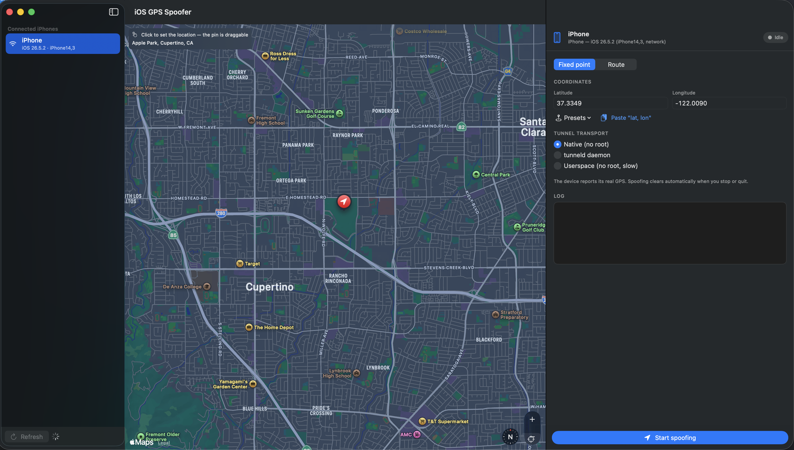
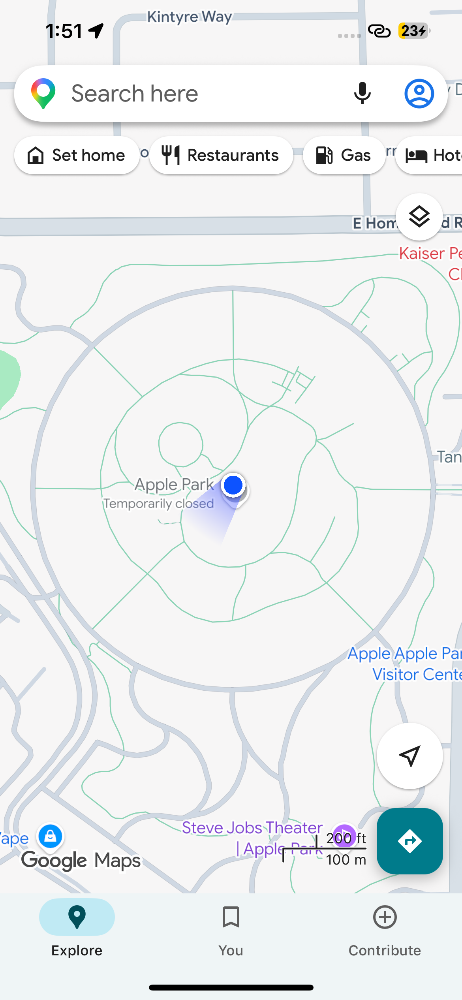
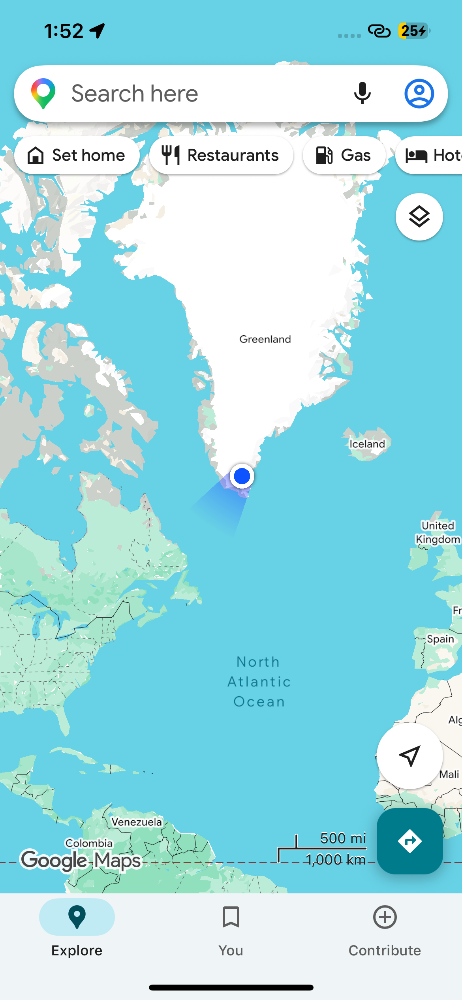
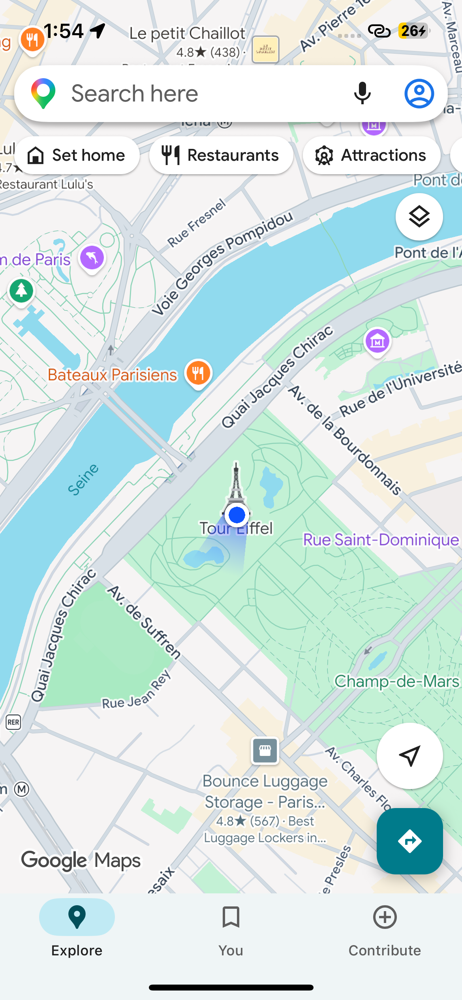
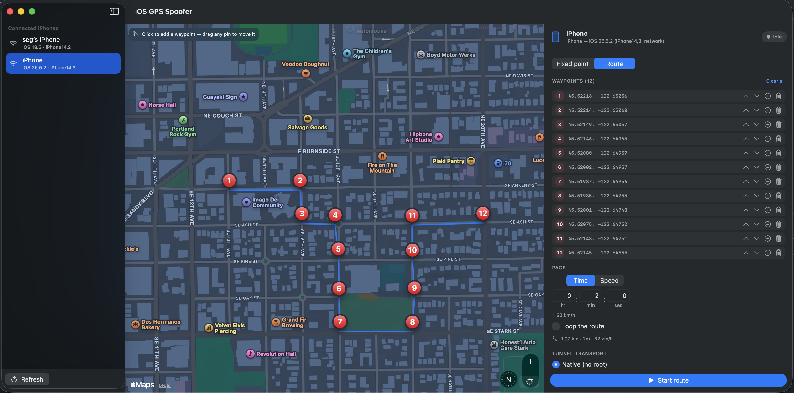

# iosgpsspoof

Spoof the GPS location of a **connected iPhone (iOS 17+)** for as long as the
tool runs. The fake location is cleared automatically on exit, and re-applied
automatically if the device disconnects and reconnects.

Ships as two front-ends over a shared core (`SpooferCore`):

- **`iosgpsspoofer-gui`** — a SwiftUI macOS app: auto-detected device list with a
  refresh button, a map you click to drop the location, coordinate fields,
  presets, transport picker, live log, and a Start/Stop toggle.
- **`iosgpsspoof`** — the CLI (`spoof`, `route`, `list`, `clear`).

It drives Apple's developer *location-simulation* service — the same mechanism
Xcode's **Product ▸ Scheme ▸ Simulate Location** uses. On iOS 17+ that service
lives behind the encrypted CoreDevice tunnel, so the actual transport is handled
by [`pymobiledevice3`](https://github.com/doronz88/pymobiledevice3); this tool is
the user-facing wrapper (CLI, device selection, the "keep it spoofed while
connected" supervision loop, clean teardown).

## Screenshots

### Fixed GPS location

Click a spot on the map (or type coordinates / pick a preset) and the connected
iPhone reports that exact location for as long as the tool runs.



The spoofed position as the iPhone itself sees it — Apple Park, the mid-Atlantic,
and the Eiffel Tower:

| Apple Park | North Atlantic | Eiffel Tower |
|:---:|:---:|:---:|
|  |  |  |

### Route

Drop waypoints A → B and any points in between, set a duration (h : m : s) or a
speed (km/h), and the iPhone moves along the path at constant speed. Optionally
loops.



## Requirements

- macOS with Xcode / Swift 6 toolchain
- Python 3 (for the bundled `pymobiledevice3` venv)
- An iPhone (iOS 17+) that is **paired & trusted** and has **Developer Mode**
  enabled — see **[IPHONE-SETUP.md](IPHONE-SETUP.md)** for the step-by-step
  device prep and troubleshooting.
- On the default `--transport native`, **no root is required** — it piggybacks
  Apple's own `remotepairingd` tunnel.

## Setup

```bash
./setup.sh          # creates .venv with pymobiledevice3, builds release binary
```

The binary lands at `.build/release/iosgpsspoof`. Copy it onto your `PATH` if you
like (`cp .build/release/iosgpsspoof /usr/local/bin/`). It looks for
`pymobiledevice3` in `./.venv/bin`, then next to the binary, then on `$PATH`; use
`--python-path` to point at a specific one.

## GUI

```bash
./run-gui.sh          # or: .build/release/iosgpsspoofer-gui
```

- The left column lists connected iPhones and **auto-refreshes every 3 s**; the
  **Refresh** button forces an immediate scan.
- Two modes, switched with the segmented control:
  - **Fixed point** — click the map (draggable pin, fills coordinates, shows the
    place name), or type lat/lon, pick a **preset**, or paste `"lat, lon"`.
    **Start spoofing** holds the device there; while running, move the pin and
    hit **Move to new coordinates** to relocate without stopping.
  - **Route** — click the map to drop point A, point B, then any points in
    between. Pins are draggable; the waypoint list lets you reorder, insert a
    midpoint, or delete. Pace it either **by time** (hr : min : sec) or **by
    speed** (km/h) — the other value is shown live — set **Loop** if you want,
    then **Start route**. The device moves along the line at constant speed.
    Edit waypoints while it runs and hit **Apply route changes** to restart.
- **Stop**, or quitting the app, restores the real GPS.

Stopping is immediate, and cleanup is robust: closing the window / Cmd-Q clears
the simulated location; a `kill` (SIGTERM/SIGINT) still kills the tunnel child;
and if the app is ever `kill -9`'d, the next launch reaps the orphaned
`pymobiledevice3` process automatically.

**Automation:** set `SPOOF_UDID=<udid>` and/or `SPOOF_START="lat,lon"` in the
environment to preselect a device and auto-start spoofing on launch.

### Package as a DMG

```bash
./package-dmg.sh              # → dist/iOS-GPS-Spoofer-<version>.dmg
./package-dmg.sh --no-venv    # lean build; app expects pymobiledevice3 on PATH
```

Builds `iOS GPS Spoofer.app` (generated icon, ad-hoc signed) and a drag-to-install
DMG. By default it bundles `./.venv` inside the app, so the app finds
`pymobiledevice3` on its own — it looks for `Contents/Resources/venv`, then
`$PYMOBILEDEVICE3`, then a `.venv` beside it, then `$PATH`.

The bundled venv's Python still references this machine's Homebrew Python, so the
default DMG runs on this Mac and Macs with the same `brew install python@3.x`.
For a portable build use `--no-venv` and have users install `pymobiledevice3`
themselves. First launch of an ad-hoc-signed app: **right-click ▸ Open**.

## CLI

```bash
# list paired devices
iosgpsspoof list

# spoof to a fixed point (Eiffel Tower). Holds until Ctrl-C, then restores real GPS.
iosgpsspoof spoof 48.8584 2.2945
iosgpsspoof spoof "48.8584,2.2945"          # single-token form also works

# choose a device / link explicitly
iosgpsspoof spoof 37.3349 -122.0090 --udid 00008110-000815C10CD1801E --connection usb

# drive the device along a GPX track, looping forever
iosgpsspoof route ./drive.gpx --loop --timing-randomness 200

# manually clear a simulated location (e.g. if a previous run was killed hard)
iosgpsspoof clear
```

While `spoof` / `route` is running it:

- checks the device is still connected; if not, waits and retries
- (re)starts the location-simulation session and holds it open
- on `Ctrl-C` (or `SIGTERM`): stops the session, runs `simulate-location clear`,
  exits. Pass `--no-clear-on-exit` to leave the fake location in place.

### Options (spoof / route)

| option | default | meaning |
|---|---|---|
| `--udid <id>` | first device | target device |
| `--connection any\|usb\|network` | `any` | which link to use / require |
| `--transport native\|tunneld\|userspace` | `native` | tunnel mechanism. `native` = no root (macOS). `tunneld` needs `sudo pymobiledevice3 remote tunneld` running. `userspace` = in-process, no root, slower |
| `--retry-interval <s>` | `5` | delay before re-establishing after a drop |
| `--no-clear-on-exit` | off | keep the fake location after exit |
| `--python-path <path>` | auto | explicit `pymobiledevice3` binary |

## Notes / limitations

- **iOS 17+ only** for the `native`/`tunneld` transports. For iOS ≤ 16 you'd use
  `pymobiledevice3 developer simulate-location` directly over usbmux.
- First run may take a few seconds while the DeveloperDiskImage is mounted and the
  tunnel is established.
- Altitude, course and speed aren't set — only latitude/longitude, same as Xcode.
- This is for development and testing of your own apps/devices.
